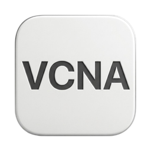

<div align="center">



# VCNA Display

**Điều khiển màn hình rời trên macOS ngay từ thanh menu**

[](../../releases/latest/download/VCNA-Display.dmg)
[](#yêu-cầu)
[](../../releases/latest)
[](#giấy-phép)

</div>

Repo này chứa **bản cài** và **feed cập nhật tự động**. Mã nguồn nằm ở repo riêng.

**3.8.2 là bản phát hành công khai đầu tiên.**

---

## Nó làm được gì

macOS coi màn hình rời như một thiết bị hạng hai: phím độ sáng không ăn, âm lượng phải với tay lên núm vặn trên màn hình, chữ mờ vì HiDPI bị tắt, đổi cổng tín hiệu thì phải bấm nút vật lý. VCNA Display nói chuyện trực tiếp với vi điều khiển của màn hình qua **DDC/CI** để lấy lại những thứ đó.

- **Độ sáng & âm lượng thật của màn hình** — gửi lệnh xuống phần cứng, không phải lớp phủ tối màu giả. Phím **F1/F2** và **F11/F12** trên bàn phím Mac dùng được cho màn hình rời như màn hình Apple
- **Chuyển cổng tín hiệu (KVM)** bằng phím tắt — một tổ hợp phím thay cho việc bấm nút trên màn hình để đổi giữa hai máy
- **Bật HiDPI cho màn 4K/5K** — chữ nét như Retina thay vì mờ nhòe
- **Extra Brightness** — vượt mốc 100% bằng phần dư sáng (EDR headroom) mà panel còn, tùy khả năng từng màn hình
- **Bật/tắt HDR** cho màn hình rời đủ điều kiện
- **Độ phân giải, tần số quét, hồ sơ màu, gamma và hiệu ứng màn hình** trong cùng một bảng
- **Sắp xếp màn hình + Preset** — lưu cả bố cục lẫn thiết lập, gọi lại bằng phím tắt
- **Màn hình ảo** và **ngắt/kết nối màn hình thật** mà không cần rút cáp
- **Bộ hút màu** — click vào bất kỳ điểm nào trên màn hình, mã HEX vào clipboard ngay
- **Giữ máy không ngủ**, khởi động cùng hệ thống
- Giao diện **tiếng Việt** và **English**

Ứng dụng chạy ở thanh menu, không có icon dưới Dock.

---

## Cài đặt

1. Tải [**VCNA-Display.dmg**](../../releases/latest/download/VCNA-Display.dmg)
2. Mở file `.dmg`, kéo **VCNA Display** vào thư mục **Applications**
3. Lần đầu mở: **bấm chuột phải** vào app → **Open** → **Open** lần nữa

   Nếu macOS vẫn chặn, vào **System Settings → Privacy & Security**, cuộn xuống dòng thông báo về VCNA Display và bấm **Open Anyway**.

   > Bản này ký ad-hoc, chưa notarize qua Apple, nên Gatekeeper chặn ở lần mở đầu tiên. Đây là hành vi bình thường với app không phát hành qua App Store. Từ lần thứ hai trở đi mở bình thường.

4. Vào **System Settings → Privacy & Security → Accessibility** và **bật quyền cho VCNA Display**

   Không có quyền này thì phím F1/F2/F11/F12 và các phím tắt sẽ không hoạt động — mọi thứ còn lại vẫn dùng được qua bảng điều khiển.

---

## Yêu cầu

| | |
|---|---|
| Hệ điều hành | macOS 14.0 (Sonoma) trở lên |
| Máy | Apple Silicon và Intel (bản universal) |
| Màn hình rời | Cần hỗ trợ **DDC/CI** để điều khiển được độ sáng/âm lượng/cổng tín hiệu. Hầu hết màn hình rời qua DisplayPort, HDMI hoặc USB-C đều có; một số dock hoặc bộ chuyển đổi làm mất kênh DDC |

Màn hình tích hợp của MacBook không dùng DDC — ứng dụng điều khiển nó bằng đường riêng của hệ thống.

---

## Dòng lệnh `vcnactl`

Công cụ dòng lệnh đi kèm sẵn trong app, không phải cài thêm:

```bash
"/Applications/VCNA Display.app/Contents/MacOS/vcnactl" display list
"/Applications/VCNA Display.app/Contents/MacOS/vcnactl" help
```

Muốn gọi ngắn ở mọi nơi:

```bash
sudo ln -sf "/Applications/VCNA Display.app/Contents/MacOS/vcnactl" /usr/local/bin/vcnactl
```

Nó điều khiển ứng dụng đang chạy qua socket cục bộ, nên app phải đang mở. Trả về JSON, tiện cho script.

---

## Tự động cập nhật

Ứng dụng tự kiểm tra bản mới qua `appcast.xml` trong release mới nhất, và chỉ nhận bản cập nhật có **chữ ký EdDSA** khớp với khoá công khai nhúng trong app. Cập nhật cũng có thể gọi tay từ bảng điều khiển.

> **Với người quản lý repo này:** mỗi release phải có đủ **cả hai** file `VCNA-Display.dmg` và `appcast.xml`. Xoá hoặc sửa `appcast.xml` là làm đứt luồng cập nhật của mọi người đang dùng.

---

## Giấy phép

MIT.

<div align="center">

Phát triển và duy trì bởi [@VCNA2K](https://github.com/VCNA2K)

</div>
