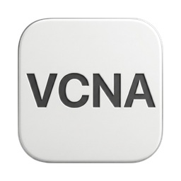

<div align="center">



# VCNA Display

**Điều khiển màn hình rời trên macOS ngay từ thanh menu**

[](../../releases/latest/download/VCNA-Display.dmg)
[](#yêu-cầu)
[](../../releases/latest)
[](#giấy-phép)

</div>

Trang tải về chính thức của **VCNA Display** cho macOS. Có gì mới trong bản này: xem [trang Release](../../releases/latest).

---

## Tính năng

Trên macOS, màn hình rời thiệt thòi hơn màn hình MacBook: phím độ sáng không điều khiển được, âm lượng phải chỉnh bằng nút trên màn hình, chữ kém nét vì thiếu HiDPI, đổi cổng tín hiệu phải bấm nút vật lý. VCNA Display điều khiển thẳng màn hình qua chuẩn **DDC/CI** để lấy lại tất cả, từ một bảng điều khiển kiểu **Control Center** trên thanh menu.

**Độ sáng & âm lượng**

- **Độ sáng và âm lượng thật của màn hình**, chỉnh ngay trên phần cứng chứ không phủ một lớp tối lên hình. Phím độ sáng và âm lượng trên bàn phím Mac dùng được cho màn hình rời.
- **Phím tắt Tăng/Giảm độ sáng** cho bàn phím không có phím độ sáng.
- **Độ sáng theo giờ**: mức sáng ban ngày và ban đêm, chuyển dần giữa hai mức.
- **Độ sáng tự động**: màn rời sáng/tối theo màn MacBook và giữ nguyên độ chênh bạn đã chỉnh. Trên MacBook Apple Silicon, tắt màn MacBook mà vẫn mở nắp thì đi theo cảm biến ánh sáng.
- **Độ sáng tăng cường**: vượt mốc 100% trên màn hình hỗ trợ HDR.

**Điều khiển màn hình rời**

- **Chuyển cổng tín hiệu (KVM)** bằng phím tắt hoặc ô **Nguồn vào**: đảo giữa hai máy, hoặc gán mỗi cổng một phím tắt riêng.
- **Tắt màn hình** bằng một cú bấm; màn tự bật lại khi bạn di chuột hoặc gõ phím.
- **Tự tắt màn hình rời** khi bật màn hình chờ, hoặc sau một khoảng thời gian không dùng máy.
- **Chế độ hình theo ứng dụng**: màn hình tự đổi chế độ hình và chế độ màu theo ứng dụng bạn đang dùng.
- **Nhớ vị trí cửa sổ**: màn rời quay lại (chuyển KVM, tắt màn, cắm lại cáp) thì cửa sổ về đúng chỗ cũ.
- **Thông số trên màn hình**: độ tương phản, chế độ màu, chế độ hiển thị, từng kênh đỏ/lục/lam, khỏi phải bấm nút trên màn.

**Hiển thị**

- **HiDPI cho màn hình từ 2K trở lên**: chữ nét như Retina.
- **Độ phân giải, tần số quét, HDR, hồ sơ màu** và tinh chỉnh hình ảnh.
- **Preset**: lưu cả bố cục lẫn thiết lập màn hình, gọi lại bằng phím tắt.
- **Sắp xếp màn hình**, **màn hình ảo**, **ngắt/kết nối màn hình** mà không cần rút cáp.

**Tiện ích**

- Ô **Chế độ tối**, **Night Shift**, **True Tone**, **Chống ngủ** ngay trên trang chính.
- **Bộ hút màu**: bấm vào bất kỳ điểm nào trên màn hình, mã màu HEX được chép sẵn để dán.
- Khởi động cùng macOS. Giao diện **tiếng Việt** và **English**.

Ứng dụng chạy ở thanh menu, không có icon dưới Dock.

---

## Cài đặt

**Cách nhanh nhất:** dán lệnh này vào Terminal. Lệnh tải bản mới nhất, cài vào **Applications** rồi mở app, và macOS không chặn ở lần mở đầu. Chạy lại bất cứ lúc nào để cập nhật.

```bash
curl -fsSL https://raw.githubusercontent.com/VCNA2K/VCNA-Display-releases/main/install.sh | bash
```

**Hoặc cài bằng file DMG:**

1. Tải [**VCNA-Display.dmg**](../../releases/latest/download/VCNA-Display.dmg)
2. Mở file `.dmg`, kéo **VCNA Display** vào thư mục **Applications**
3. Mở app lần đầu, macOS sẽ chặn vì app chưa được Apple công chứng (notarize). Cách mở:
   - **macOS 15 trở lên:** mở app một lần (sẽ bị chặn) → **System Settings → Privacy & Security** → cuộn xuống dòng về VCNA Display → **Open Anyway** → nhập mật khẩu.
   - **macOS 14:** bấm chuột phải vào app → **Open** → **Open** lần nữa.

   Từ lần thứ hai trở đi app mở bình thường.

### Quyền cần cấp

| Quyền | Khi nào cần |
|---|---|
| **Accessibility** | Để phím độ sáng, âm lượng trên bàn phím điều khiển được màn hình rời, và để **Nhớ vị trí cửa sổ** dời được cửa sổ. Khi bạn bật một trong hai tính năng này trong Cài đặt, app sẽ mở đúng chỗ để cấp quyền. Phím tắt tự đặt không cần quyền này. |
| **Mật khẩu quản trị** | Khi bật HiDPI cho một màn hình rời. |

Sau khi cập nhật mà phím độ sáng hoặc Nhớ vị trí cửa sổ ngừng hoạt động: vào **System Settings → Privacy & Security → Accessibility**, tắt VCNA Display rồi bật lại.

---

## Yêu cầu

| | |
|---|---|
| Hệ điều hành | macOS 14.0 (Sonoma) trở lên |
| Máy | Apple Silicon và Intel (bản universal). Ngắt/kết nối màn hình mà không rút cáp chỉ có trên Apple Silicon |
| Màn hình rời | Cần hỗ trợ **DDC/CI** để điều khiển độ sáng, âm lượng, cổng tín hiệu và các thông số trên màn. Hầu hết màn hình rời qua DisplayPort, HDMI hoặc USB-C đều có; một số dock hoặc bộ chuyển đổi làm mất kênh DDC |

Màn hình MacBook không cần DDC/CI: app điều khiển nó trực tiếp.

---

## Tự động cập nhật

App tự kiểm tra bản mới và báo ngay trên bảng điều khiển. Kiểm tra bằng tay: bảng điều khiển trên thanh menu → **Cài đặt** → **Kiểm tra cập nhật**.

Mỗi bản cập nhật đều được kiểm tra chữ ký trước khi cài, nên app chỉ nhận đúng bản do tác giả phát hành.

---

## Giấy phép

VCNA Display **miễn phí**: bạn được tải, cài và dùng trên bao nhiêu máy tuỳ ý, cho cả việc cá nhân lẫn công việc.

Muốn giới thiệu cho bạn bè hay đồng nghiệp, hãy gửi họ link trang này: họ sẽ nhận đúng bản chính thức mới nhất, và app tự cập nhật từ đó về sau.

© 2026 Võ Công Ngọc Anh. Bảo lưu mọi quyền.

---

## Góp ý & báo lỗi

Gặp lỗi hay có ý tưởng cho tính năng mới? Hãy mở một [Issue](../../issues). Ghi kèm phiên bản app và tên màn hình rời để được xử lý nhanh hơn.

<div align="center">

Phát triển và duy trì bởi [@VCNA2K](https://github.com/VCNA2K)

</div>
